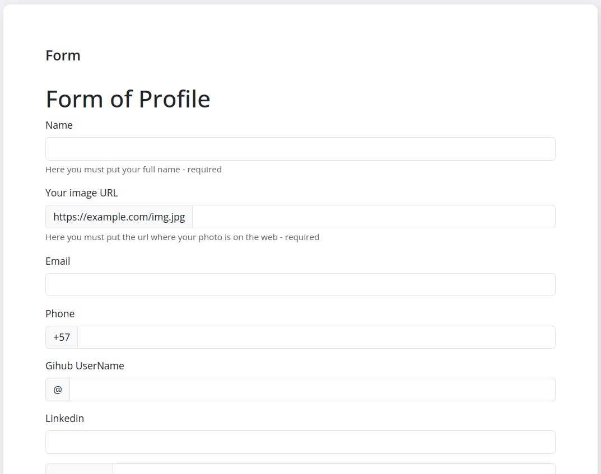
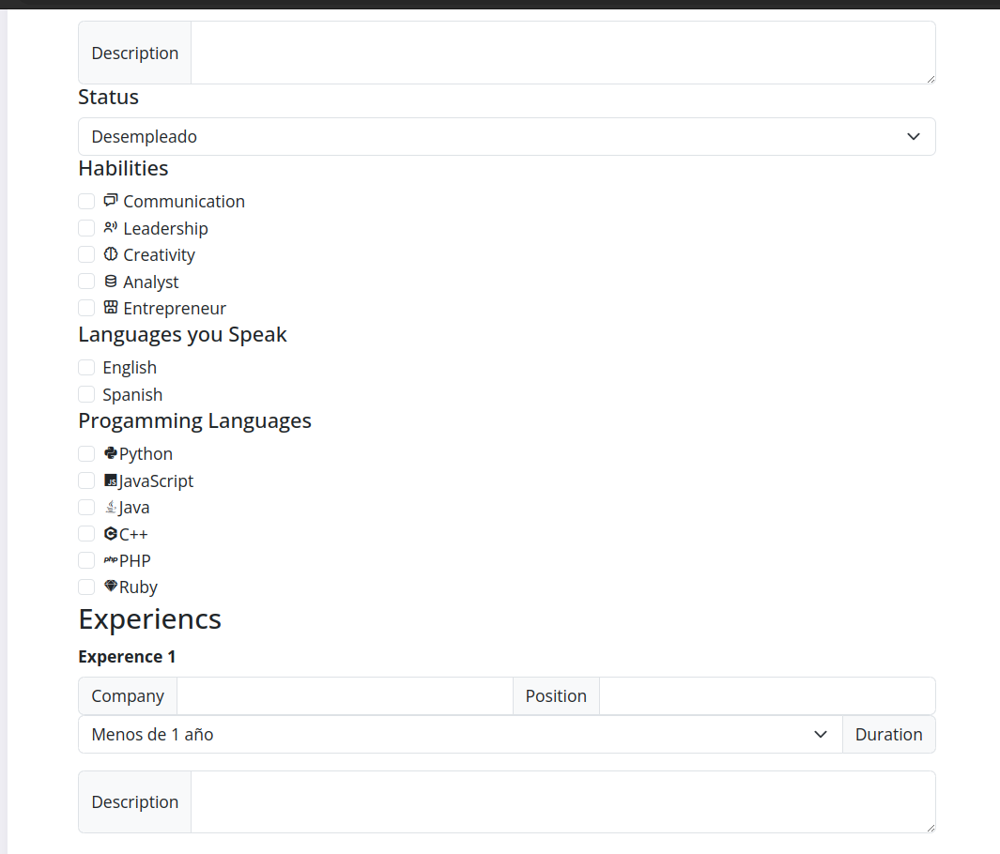
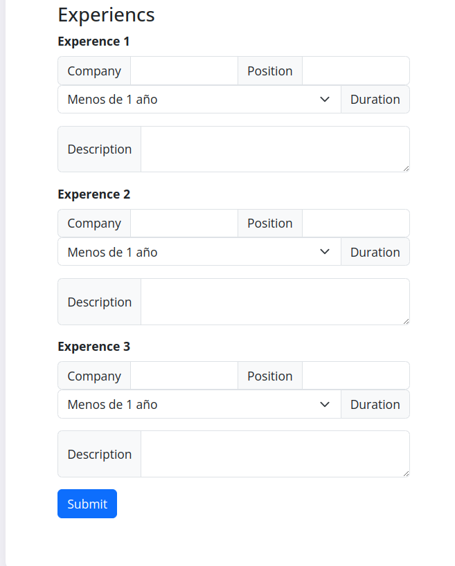

# Portafolio Web Project
Portfolio, to save and create resumes

## JSON-server installation

To install json-server in the project, we must have node, if we do not have it we can use the following tool to install Node and install npm.

### NVM installation Windows

First we will download this [NVM zip](https://github.com/coreybutler/nvm-windows/releases/download/1.1.7/nvm-setup.zip), then we will unzip it and run the normal installation.

We open a terminal and write the following command:

```shell
nvm --version
```

Now with nvm installed, we proceed on a command line to install node and npm:

```shell
nvm install 18.16.1
```

Then we verify that everything has been installed and we also verify the list of versions.

```shell
node -v
#18.16.1

npm -v
# 9.6.7
```

After having installed npm, we continue with the installation of json-server

```shell
npm -E -D install json-server 
```

To start the json-server, it will run on port 5500, so we run the following command:

```shell
npm run dev
```

## How to use

### Form
My form can accept several values which are added to the database. The form does not have identification, therefore it will add repeated information if it is made.






